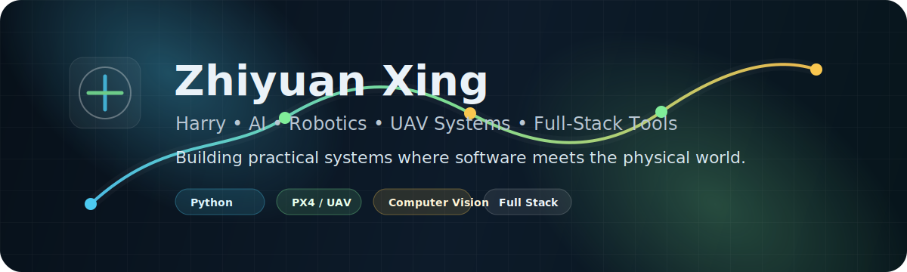

<p align="center">
  
</p>

<h1 align="center">Harry Xing</h1>

<p align="center">
  Student developer building practical AI, robotics, computer vision, UAV localization, and full-stack software systems.
</p>

<p align="center">
  <a href="https://github.com/Ha22yX?tab=repositories"></a>
  <a href="https://isef.rosebeg.com"></a>
  
</p>

## About

I like building systems that connect software with the physical world: robot perception, UAV localization, AI learning tools, automation workflows, and web apps that solve concrete problems.

My strongest interests sit at the intersection of:

- AI agents, machine learning, and local-first AI tools
- Robotics, UAV docking, relative localization, and computer vision
- Full-stack web apps with clean user, admin, and data workflows
- Education technology, developer tools, and practical automation

## Current Focus

- Multi-sensor relative localization for autonomous UAV docking
- AI tutoring systems with document ingestion and adaptive feedback
- Full-stack products with real admin dashboards and operational workflows
- Small tools that remove repetitive work from real-world processes

## Featured Projects

<table>
  <tr>
    <td width="50%">
      <h3><a href="https://github.com/Ha22yX/Mother-Ship-Docking-Drone-System">Mother-Ship Docking Drone System</a></h3>
      <p>Autonomous dual-UAV docking research platform using GPS/RTK, UWB, AprilTag vision, PX4/MAVLink, ESP32, and relative localization.</p>
      <p>
        <code>PX4</code> <code>MAVLink</code> <code>UWB</code> <code>AprilTag</code> <code>ESP32</code> <code>Robotics</code>
      </p>
    </td>
    <td width="50%">
      <h3><a href="https://github.com/Ha22yX/SAT-AI-Tutor">SAT-AI-Tutor</a></h3>
      <p>AI-powered SAT learning platform with adaptive practice, PDF ingestion, analytics, and visual explanations.</p>
      <p>
        <code>AI</code> <code>Education</code> <code>PDF</code> <code>Analytics</code> <code>Full Stack</code>
      </p>
    </td>
  </tr>
  <tr>
    <td width="50%">
      <h3><a href="https://github.com/Ha22yX/onlypt-recruiting">onlypt-recruiting</a></h3>
      <p>Flask website and admin CMS for a focused recruiting site, built around practical content and operations workflows.</p>
      <p>
        <code>Python</code> <code>Flask</code> <code>CMS</code> <code>Admin Dashboard</code> <code>Recruiting</code>
      </p>
    </td>
    <td width="50%">
      <h3><a href="https://github.com/Ha22yX/Bridge-US-V2">Bridge-US-V2</a></h3>
      <p>Multilingual community platform with posts, replies, search, AI Q&amp;A, moderation, notifications, and admin tooling.</p>
      <p>
        <code>Community</code> <code>AI Q&amp;A</code> <code>Moderation</code> <code>Search</code> <code>Admin</code>
      </p>
    </td>
  </tr>
  <tr>
    <td width="50%">
      <h3><a href="https://github.com/Ha22yX/dxf-auto-shape-tool">dxf-auto-shape-tool</a></h3>
      <p>DXF generator for surfboard vacuum table suction holes and capsule slots.</p>
      <p>
        <code>DXF</code> <code>CAD</code> <code>Automation</code> <code>Geometry</code>
      </p>
    </td>
    <td width="50%">
      <h3><a href="https://github.com/Ha22yX/UWB-Project">UWB-Project</a></h3>
      <p>UWB ranging, trilateration, ESP32-S3 firmware, visualization, and Pixhawk/MAVLink integration for UAV docking.</p>
      <p>
        <code>UWB</code> <code>ESP32-S3</code> <code>Trilateration</code> <code>Pixhawk</code> <code>Localization</code>
      </p>
    </td>
  </tr>
</table>

## Tech Stack

<p>
  
  
  
  
  
  
  
  
  
</p>

```text
Robotics | UAV Systems | Computer Vision | AI Agents | Full-Stack Web Apps
PX4 / MAVLink | ESP32 | UWB Localization | Flask | Automation Tools
```

## Profile Snapshot

<table>
  <tr>
    <td width="33%">
      <strong>Core languages</strong><br>
      Python, C/C++, Java, TypeScript
    </td>
    <td width="33%">
      <strong>Main domains</strong><br>
      AI tools, robotics, UAV systems, web apps
    </td>
    <td width="33%">
      <strong>Build style</strong><br>
      Practical prototypes with usable interfaces
    </td>
  </tr>
</table>

## Direction

I am exploring how AI systems can become useful in real workflows: learning support, robotics perception, media accessibility, and small tools that remove repetitive work.
